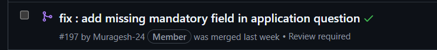

# Pull Request Rules

Before creating a PR:

1. Do **not** rely only on `npm run dev`.

2. Run a production build:

   ```bash
   npm run build
   ```

3. Run lint checks:

   ```bash
   npm run lint
   ```

4. Or simply run the predefined verification script:

   ```bash
   npm run check
   ```

5. Fix **all build errors and lint errors** before opening a PR.

6. Do **not** create a PR if any of the above commands fail.

## GitHub Actions

We have integrated GitHub Actions to automatically verify builds and lint checks.

After opening a PR:

* Ensure all GitHub Action checks pass.
* Verify that you receive a ✅ **green checkmark** on the PR page.
* You should see green checkmarks for all checks before requesting a review or merging the PR.



## PR Description Template

Copy the following template when creating a PR and replace the placeholders with your changes:

```md
## Summary

Brief description of what this PR does.

## Changes Made

- Change 1
- Change 2
- Change 3

## Screenshots / Demo

(Add screenshots, recordings, or GIFs for UI changes)

## Testing

- [ ] npm run build
- [ ] npm run lint
- [ ] npm run check
- [ ] Verified feature works as expected

## Notes

Anything reviewers should know.
```

## Goal

Maintain a **build error free** and **lint error free** codebase from Day 1.

*Also use clean commit messages and descriptive PR titles to help reviewers understand your changes.*
